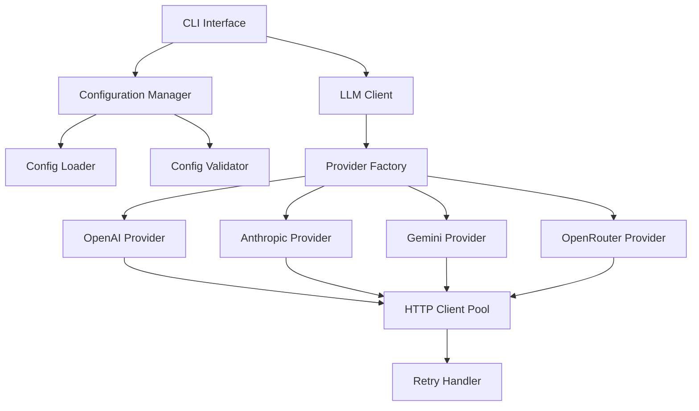
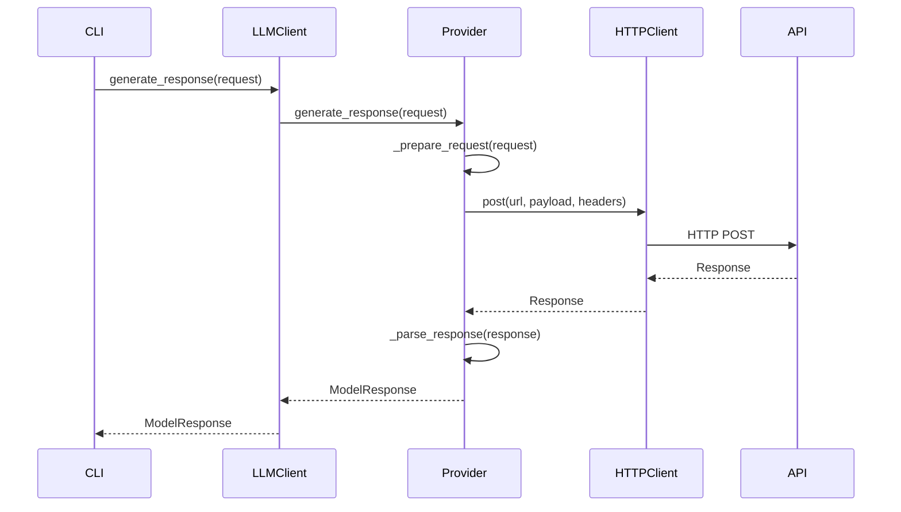

# Design Document

## Overview

The LLM Connector feature provides a unified interface for connecting to multiple Large Language Model providers through a configuration-driven approach. The design follows the existing project architecture with modular components, comprehensive error handling, and extensible provider support. The connector abstracts provider-specific implementations behind a common interface while supporting provider-specific parameters and authentication methods.

## Development Standards

### Package Management
The LLM connector follows strict dependency management practices:
- **ALWAYS** use `uv` for dependency management with `pyproject.toml` - never use `pip`
- **CRITICAL**: Before adding any dependencies, always check whether they have already been added to `pyproject.toml`
- Use `uv add <package>` for production dependencies
- Use `uv add --dev <package>` for development dependencies
- Use `uv sync` to install dependencies from lock file
- Use `uv run <command>` to execute commands in the virtual environment

### Test-First Development
The implementation follows strict Test-Driven Development (TDD) practices:
- **MANDATORY**: All unit tests and mock tests must be created as subtasks before actual code implementation
- **CRITICAL**: Tests must be created as subtasks before any implementation work begins
- Write tests before implementing functionality
- Use pytest as the testing framework (check `pyproject.toml` first, add with `uv add --dev pytest` if not present)
- Use pytest-mock for mocking (check `pyproject.toml` first, add with `uv add --dev pytest-mock` if not present)

### Code Style Standards
- Use 2 spaces for indentation (not the standard 4 spaces)
- Use type hints for all function parameters and return values
- Use Google-style docstrings for all public functions and classes
- Follow snake_case for variables and functions, PascalCase for classes
- Use f-strings for string interpolation
- Use double quotes for strings by default

## Architecture

### High-Level Architecture



### Module Structure

The LLM connector follows the existing project structure under `rationale_benchmark/llm/`:

```
rationale_benchmark/llm/
├── __init__.py
├── client.py              # Main LLM client interface
├── config/
│   ├── __init__.py
│   ├── loader.py          # Configuration loading
│   ├── validator.py       # Configuration validation
│   └── models.py          # Configuration data models
├── providers/
│   ├── __init__.py
│   ├── base.py            # Abstract provider interface
│   ├── openai.py          # OpenAI provider implementation
│   ├── anthropic.py       # Anthropic provider implementation
│   ├── gemini.py          # Google Gemini provider implementation
│   └── openrouter.py      # OpenRouter provider implementation
├── http/
│   ├── __init__.py
│   ├── client.py          # HTTP client with connection pooling
│   └── retry.py           # Retry logic with exponential backoff
└── exceptions.py          # Custom exception classes
```

## Components and Interfaces

### Configuration Management

#### Configuration Data Models

```python
@dataclass
class ProviderConfig:
  """Configuration for a single LLM provider."""
  name: str
  api_key: str
  base_url: Optional[str] = None
  timeout: int = 30
  max_retries: int = 3
  models: List[str] = field(default_factory=list)
  default_params: Dict[str, Any] = field(default_factory=dict)
  provider_specific: Dict[str, Any] = field(default_factory=dict)

@dataclass
class LLMConfig:
  """Complete LLM configuration with all providers."""
  defaults: Dict[str, Any]
  providers: Dict[str, ProviderConfig]
  
  @classmethod
  def from_file(cls, config_dir: Path, config_name: str = "default-llms") -> "LLMConfig":
    """Load configuration from a single file."""
    pass

@dataclass
class ModelRequest:
  """Request parameters for LLM generation."""
  prompt: str
  model: str
  temperature: float = 0.7
  max_tokens: int = 1000
  system_prompt: Optional[str] = None
  stop_sequences: Optional[List[str]] = None
  provider_specific: Dict[str, Any] = field(default_factory=dict)

@dataclass
class ModelResponse:
  """Standardized response from LLM providers."""
  text: str
  model: str
  provider: str
  timestamp: datetime
  latency_ms: int
  token_count: Optional[int] = None
  finish_reason: Optional[str] = None
  cost_estimate: Optional[float] = None
  metadata: Dict[str, Any] = field(default_factory=dict)
```

#### Configuration Loader

```python
class ConfigLoader:
  """Handles loading of LLM configuration files."""
  
  def __init__(self, config_dir: Path):
    self.config_dir = config_dir
  
  def load_config(self, config_name: str) -> LLMConfig:
    """Load configuration from specified file."""
    config_file = self.config_dir / f"{config_name}.yaml"
    if not config_file.exists():
      raise ConfigurationError(f"Configuration file not found: {config_file}")
    
    with open(config_file, 'r') as f:
      config_dict = yaml.safe_load(f)
    
    resolved_config = self._resolve_environment_variables(config_dict)
    return LLMConfig.from_dict(resolved_config)
  
  def list_available_configs(self) -> List[str]:
    """List all available configuration files."""
    pass
  
  def _resolve_environment_variables(self, config_dict: Dict) -> Dict:
    """Resolve ${VAR} patterns in configuration."""
    pass
```

#### Configuration Validator

```python
class ConfigValidator:
  """Validates LLM configuration structure and values."""
  
  def validate_config(self, config: LLMConfig) -> List[str]:
    """Validate complete configuration, return list of errors."""
    errors = []
    errors.extend(self._validate_defaults(config.defaults))
    for name, provider in config.providers.items():
      errors.extend(self._validate_provider(name, provider))
    return errors
  
  def validate_environment_variables(self, config: LLMConfig) -> List[str]:
    """Validate required environment variables are present."""
    pass
  
  def _validate_provider(self, name: str, provider: ProviderConfig) -> List[str]:
    """Validate individual provider configuration."""
    pass
```

### Provider Interface

#### Abstract Provider Base

```python
from abc import ABC, abstractmethod

class LLMProvider(ABC):
  """Abstract base class for all LLM providers."""
  
  def __init__(self, config: ProviderConfig, http_client: HTTPClient):
    self.config = config
    self.http_client = http_client
  
  @abstractmethod
  async def generate_response(self, request: ModelRequest) -> ModelResponse:
    """Generate response from the LLM."""
    pass
  
  @abstractmethod
  async def list_models(self) -> List[str]:
    """List available models for this provider."""
    pass
  
  @abstractmethod
  def validate_config(self) -> List[str]:
    """Validate provider-specific configuration."""
    pass
  
  @abstractmethod
  def _prepare_request(self, request: ModelRequest) -> Dict[str, Any]:
    """Convert ModelRequest to provider-specific format."""
    pass
  
  @abstractmethod
  def _parse_response(self, response: Dict[str, Any], request: ModelRequest) -> ModelResponse:
    """Convert provider response to ModelResponse."""
    pass
```

#### Provider Implementations

Each provider implements the abstract interface with provider-specific logic, ensuring no streaming support and comprehensive response validation:

```python
class OpenAIProvider(LLMProvider):
  """OpenAI API provider implementation with structured output validation."""
  
  def __init__(self, config: ProviderConfig, http_client: HTTPClient):
    super().__init__(config, http_client)
    self.base_url = config.base_url or "https://api.openai.com/v1"
  
  async def generate_response(self, request: ModelRequest) -> ModelResponse:
    """Generate response using OpenAI API with no streaming and strict validation."""
    headers = {
      "Authorization": f"Bearer {self.config.api_key}",
      "Content-Type": "application/json"
    }
    
    payload = self._prepare_request(request)
    # Explicitly disable streaming - this is critical
    payload["stream"] = False
    
    start_time = time.time()
    
    try:
      response = await self.http_client.post(
        f"{self.base_url}/chat/completions",
        json=payload,
        headers=headers
      )
      
      if response.status != 200:
        raise ProviderError("openai", f"API request failed with status {response.status}")
      
      response_data = response.json()
      
    except Exception as e:
      raise ProviderError("openai", f"Request failed: {str(e)}", e)
    
    latency_ms = int((time.time() - start_time) * 1000)
    
    # Validate response structure BEFORE parsing
    self._validate_response_structure(response_data)
    
    # Parse response after validation
    parsed_response = self._parse_response(response_data, request, latency_ms)
    
    return parsed_response
  
  def _validate_response_structure(self, response_data: Dict[str, Any]) -> None:
    """Comprehensive validation of OpenAI response structure.
    
    This method performs exhaustive validation of the OpenAI API response
    to ensure all required fields are present and properly formatted.
    
    Args:
      response_data: Raw response dictionary from OpenAI API
      
    Raises:
      ResponseValidationError: If any validation check fails
    """
    # Check top-level required fields
    required_fields = ["choices", "model", "usage", "object"]
    for field in required_fields:
      if field not in response_data:
        raise ResponseValidationError(f"Missing required field '{field}' in OpenAI response")
    
    # Validate object type
    if response_data["object"] != "chat.completion":
      raise ResponseValidationError(f"Invalid object type in OpenAI response: expected 'chat.completion', got '{response_data['object']}'")
    
    # Validate choices array
    if not isinstance(response_data["choices"], list) or not response_data["choices"]:
      raise ResponseValidationError("OpenAI response 'choices' must be a non-empty array")
    
    # Validate first choice structure (we only use the first choice)
    choice = response_data["choices"][0]
    required_choice_fields = ["message", "finish_reason", "index"]
    for field in required_choice_fields:
      if field not in choice:
        raise ResponseValidationError(f"Missing required field '{field}' in OpenAI choice")
    
    # Validate choice index
    if not isinstance(choice["index"], int) or choice["index"] < 0:
      raise ResponseValidationError(f"Invalid choice index in OpenAI response: {choice['index']}")
    
    # Validate message structure
    message = choice["message"]
    if not isinstance(message, dict):
      raise ResponseValidationError("OpenAI response message must be a dictionary")
    
    required_message_fields = ["content", "role"]
    for field in required_message_fields:
      if field not in message:
        raise ResponseValidationError(f"Missing required field '{field}' in OpenAI message")
    
    # Validate message role
    if message["role"] != "assistant":
      raise ResponseValidationError(f"Invalid message role in OpenAI response: expected 'assistant', got '{message['role']}'")
    
    # Validate content is not empty
    if not message["content"] or not isinstance(message["content"], str):
      raise ResponseValidationError("OpenAI response message content must be a non-empty string")
    
    if len(message["content"].strip()) == 0:
      raise ResponseValidationError("OpenAI response message content cannot be empty or whitespace only")
    
    # Validate finish reason
    valid_finish_reasons = ["stop", "length", "function_call", "content_filter", "null"]
    if choice["finish_reason"] not in valid_finish_reasons:
      logger.warning(f"Unexpected finish reason in OpenAI response: {choice['finish_reason']}")
    
    # Validate usage information
    usage = response_data["usage"]
    if not isinstance(usage, dict):
      raise ResponseValidationError("OpenAI usage must be a dictionary")
    
    required_usage_fields = ["prompt_tokens", "completion_tokens", "total_tokens"]
    for field in required_usage_fields:
      if field not in usage:
        raise ResponseValidationError(f"Missing usage field '{field}' in OpenAI response")
      if not isinstance(usage[field], int) or usage[field] < 0:
        raise ResponseValidationError(f"OpenAI usage field '{field}' must be a non-negative integer, got {usage[field]}")
    
    # Validate token count consistency
    if usage["total_tokens"] != usage["prompt_tokens"] + usage["completion_tokens"]:
      raise ResponseValidationError(f"OpenAI token count inconsistency: total={usage['total_tokens']}, sum={usage['prompt_tokens'] + usage['completion_tokens']}")
    
    # Validate model field
    if not isinstance(response_data["model"], str) or not response_data["model"]:
      raise ResponseValidationError("OpenAI response model must be a non-empty string")
    
    # Additional validation for streaming indicators (should never be present)
    if "stream" in response_data and response_data["stream"]:
      raise ResponseValidationError("OpenAI response indicates streaming mode, but streaming is not supported")
    
    logger.debug(f"OpenAI response structure validation passed for model {response_data['model']}")
  
  def _prepare_request(self, request: ModelRequest) -> Dict[str, Any]:
    """Convert ModelRequest to OpenAI format, ensuring no streaming.
    
    This method creates the request payload for OpenAI API with strict
    streaming prevention and comprehensive parameter validation.
    
    Args:
      request: The ModelRequest to convert
      
    Returns:
      Dict containing the OpenAI API request payload
      
    Raises:
      StreamingNotSupportedError: If streaming parameters are detected
    """
    # Build base payload with explicit streaming disabled
    payload = {
      "model": request.model,
      "messages": [{"role": "user", "content": request.prompt}],
      "temperature": request.temperature,
      "max_tokens": request.max_tokens,
      "stream": False  # Explicitly disable streaming - CRITICAL requirement
    }
    
    # Add system prompt if provided
    if request.system_prompt:
      payload["messages"].insert(0, {"role": "system", "content": request.system_prompt})
    
    # Add stop sequences if provided
    if request.stop_sequences:
      payload["stop"] = request.stop_sequences
    
    # Strictly filter out ALL streaming-related parameters
    streaming_params = {
      "stream", "streaming", "stream_options", "stream_usage", 
      "stream_callback", "stream_handler", "incremental"
    }
    
    blocked_params = []
    for key, value in request.provider_specific.items():
      if key in streaming_params:
        blocked_params.append(key)
        logger.warning(f"Blocked streaming parameter '{key}' in OpenAI request")
      else:
        # Validate parameter before adding
        if self._is_valid_openai_parameter(key, value):
          payload[key] = value
        else:
          logger.warning(f"Skipped invalid OpenAI parameter '{key}': {value}")
    
    # Raise error if streaming was attempted
    if blocked_params:
      raise StreamingNotSupportedError(f"Streaming parameters not supported: {blocked_params}")
    
    # Final validation that no streaming is enabled
    if payload.get("stream", False):
      raise StreamingNotSupportedError("Stream parameter cannot be True")
    
    logger.debug(f"Prepared OpenAI request for {request.model} with {len(payload)} parameters")
    return payload
  
  def _is_valid_openai_parameter(self, key: str, value: Any) -> bool:
    """Validate that a parameter is valid for OpenAI API."""
    # List of known valid OpenAI parameters
    valid_params = {
      "frequency_penalty", "logit_bias", "logprobs", "top_logprobs",
      "max_tokens", "n", "presence_penalty", "response_format",
      "seed", "stop", "temperature", "top_p", "tools", "tool_choice",
      "user", "function_call", "functions"
    }
    
    return key in valid_params
  
  def _parse_response(self, response_data: Dict[str, Any], request: ModelRequest, latency_ms: int) -> ModelResponse:
    """Parse OpenAI response into standardized ModelResponse."""
    choice = response_data["choices"][0]
    message = choice["message"]
    usage = response_data["usage"]
    
    return ModelResponse(
      text=message["content"],
      model=response_data["model"],
      provider="openai",
      timestamp=datetime.now(),
      latency_ms=latency_ms,
      token_count=usage["total_tokens"],
      finish_reason=choice["finish_reason"],
      cost_estimate=self._estimate_cost(usage, response_data["model"]),
      metadata={
        "prompt_tokens": usage["prompt_tokens"],
        "completion_tokens": usage["completion_tokens"],
        "finish_reason": choice["finish_reason"],
        "choice_index": choice["index"]
      }
    )

class AnthropicProvider(LLMProvider):
  """Anthropic API provider implementation with structured output validation."""
  
  def __init__(self, config: ProviderConfig, http_client: HTTPClient):
    super().__init__(config, http_client)
    self.base_url = config.base_url or "https://api.anthropic.com"
  
  async def generate_response(self, request: ModelRequest) -> ModelResponse:
    """Generate response using Anthropic API with no streaming and strict validation."""
    headers = {
      "x-api-key": self.config.api_key,
      "Content-Type": "application/json",
      "anthropic-version": "2023-06-01"
    }
    
    payload = self._prepare_request(request)
    # Anthropic doesn't use 'stream' parameter, but ensure no streaming params
    
    start_time = time.time()
    
    try:
      response = await self.http_client.post(
        f"{self.base_url}/v1/messages",
        json=payload,
        headers=headers
      )
      
      if response.status != 200:
        raise ProviderError("anthropic", f"API request failed with status {response.status}")
      
      response_data = response.json()
      
    except Exception as e:
      raise ProviderError("anthropic", f"Request failed: {str(e)}", e)
    
    latency_ms = int((time.time() - start_time) * 1000)
    
    # Validate response structure BEFORE parsing
    self._validate_response_structure(response_data)
    
    # Parse response after validation
    parsed_response = self._parse_response(response_data, request, latency_ms)
    
    return parsed_response
  
  def _validate_response_structure(self, response_data: Dict[str, Any]) -> None:
    """Comprehensive validation of Anthropic response structure."""
    # Check top-level required fields
    required_fields = ["content", "model", "role", "stop_reason", "usage"]
    for field in required_fields:
      if field not in response_data:
        raise ResponseValidationError(f"Missing required field '{field}' in Anthropic response")
    
    # Validate content array
    if not isinstance(response_data["content"], list) or not response_data["content"]:
      raise ResponseValidationError("Anthropic response 'content' must be a non-empty array")
    
    # Validate first content block
    content_block = response_data["content"][0]
    if not isinstance(content_block, dict) or "text" not in content_block or "type" not in content_block:
      raise ResponseValidationError("Anthropic content block must have 'text' and 'type' fields")
    
    if content_block["type"] != "text":
      raise ResponseValidationError("Anthropic content block type must be 'text'")
    
    if not content_block["text"] or not isinstance(content_block["text"], str):
      raise ResponseValidationError("Anthropic content text must be a non-empty string")
    
    # Validate usage information
    usage = response_data["usage"]
    required_usage_fields = ["input_tokens", "output_tokens"]
    for field in required_usage_fields:
      if field not in usage or not isinstance(usage[field], int) or usage[field] < 0:
        raise ResponseValidationError(f"Anthropic usage field '{field}' must be a non-negative integer")
  
  def _prepare_request(self, request: ModelRequest) -> Dict[str, Any]:
    """Convert ModelRequest to Anthropic format, ensuring no streaming."""
    messages = [{"role": "user", "content": request.prompt}]
    
    payload = {
      "model": request.model,
      "messages": messages,
      "max_tokens": request.max_tokens,
      "temperature": request.temperature
    }
    
    if request.system_prompt:
      payload["system"] = request.system_prompt
    
    if request.stop_sequences:
      payload["stop_sequences"] = request.stop_sequences
    
    # Filter out any streaming-related parameters
    streaming_params = {"stream", "streaming", "stream_options"}
    for key, value in request.provider_specific.items():
      if key not in streaming_params:
        payload[key] = value
      else:
        logger.warning(f"Blocked streaming parameter '{key}' in Anthropic request")
    
    return payload
```

### HTTP Client and Connection Management

#### HTTP Client with Connection Pooling

```python
class HTTPClient:
  """HTTP client with connection pooling."""
  
  def __init__(self, max_connections: int = 100, timeout: int = 30):
    self.session = aiohttp.ClientSession(
      connector=aiohttp.TCPConnector(limit=max_connections),
      timeout=aiohttp.ClientTimeout(total=timeout)
    )
    self.retry_handler = RetryHandler()
  
  async def post(self, url: str, **kwargs) -> aiohttp.ClientResponse:
    """Make POST request with retries."""
    return await self.retry_handler.execute(
      self.session.post, url, **kwargs
    )
  
  async def close(self):
    """Close the HTTP session and connections."""
    await self.session.close()

#### Conversation Context Management

```python
class ConversationContext:
  """Manages conversation history for maintaining context across questions."""
  
  def __init__(self, model: str, provider: str):
    self.model = model
    self.provider = provider
    self.messages: List[Dict[str, str]] = []
    self.system_prompt: Optional[str] = None
  
  def add_system_prompt(self, prompt: str) -> None:
    """Set the system prompt for the conversation."""
    self.system_prompt = prompt
  
  def add_user_message(self, content: str) -> None:
    """Add user message to conversation history."""
    self.messages.append({"role": "user", "content": content})
  
  def add_assistant_message(self, content: str) -> None:
    """Add assistant response to conversation history."""
    self.messages.append({"role": "assistant", "content": content})
  
  def get_messages(self) -> List[Dict[str, str]]:
    """Get complete message history including system prompt."""
    messages = []
    if self.system_prompt:
      messages.append({"role": "system", "content": self.system_prompt})
    messages.extend(self.messages)
    return messages
  
  def clear_history(self) -> None:
    """Clear conversation history while keeping system prompt."""
    self.messages = []
```

### Request Queue Management

```python
class ProviderRequestQueue:
  """Manages sequential request processing for a single LLM provider.
  
  This class ensures that requests to the same LLM provider are processed
  sequentially to respect rate limits and avoid overwhelming the provider,
  while allowing concurrent processing across different providers.
  
  Key features:
  - FIFO queue processing with asyncio.Queue
  - Sequential request processing per provider
  - Future-based result coordination
  - Comprehensive response validation
  - Graceful error handling without affecting other providers
  """
  
  def __init__(self, provider_name: str, provider: LLMProvider, queue_timeout: int = 30):
    self.provider_name = provider_name
    self.provider = provider
    self.queue = asyncio.Queue()
    self.processing_task = None
    self.is_processing = False
    self.lock = asyncio.Lock()
    self.queue_timeout = queue_timeout
    self.response_validator = ResponseValidator()
  
  async def add_request(self, request: ModelRequest) -> ModelResponse:
    """Add request to queue and wait for result.
    
    This method ensures that all requests to this provider are processed
    sequentially, maintaining strict FIFO order and respecting rate limits.
    
    Args:
      request: The ModelRequest to process
      
    Returns:
      ModelResponse: Validated response from the provider
      
    Raises:
      ResponseValidationError: If response validation fails
      ProviderError: If the provider request fails
    """
    # Create future for coordinating response delivery
    future = asyncio.Future()
    
    # Add request and future to queue as tuple
    await self.queue.put((request, future))
    logger.debug(f"Added request to queue for {self.provider_name}:{request.model}")
    
    # Start processing if not already running
    async with self.lock:
      if not self.is_processing:
        self.processing_task = asyncio.create_task(self._process_queue())
        logger.debug(f"Started queue processing for {self.provider_name}")
    
    # Wait for result from processing task
    return await future
  
  async def _process_queue(self):
    """Process requests sequentially from the queue.
    
    This method processes one request at a time, ensuring that the next
    request is only sent after the previous one has been fully responded to.
    The queue remains active for a configurable timeout period.
    """
    self.is_processing = True
    logger.info(f"Queue processing started for {self.provider_name}")
    
    try:
      while True:
        try:
          # Wait for next request with configurable timeout
          request, future = await asyncio.wait_for(
            self.queue.get(), timeout=self.queue_timeout
          )
          
          try:
            # Process request sequentially - wait for complete response
            logger.debug(f"Processing request for {self.provider_name}:{request.model}")
            
            # Ensure no streaming parameters before processing
            validated_request = self._ensure_no_streaming(request)
            
            # Make request and wait for complete response
            response = await self.provider.generate_response(validated_request)
            
            # Comprehensive response validation before returning
            self.response_validator.validate_complete_response(response, self.provider_name)
            
            # Set successful result
            future.set_result(response)
            logger.debug(f"Completed request for {self.provider_name}:{request.model} in {response.latency_ms}ms")
            
          except Exception as e:
            logger.error(f"Request failed for {self.provider_name}: {e}")
            future.set_exception(e)
          finally:
            self.queue.task_done()
            
        except asyncio.TimeoutError:
          # No requests in queue for timeout period, exit processing
          logger.debug(f"Queue processing stopped for {self.provider_name} - no requests for {self.queue_timeout}s")
          break
          
    except Exception as e:
      logger.error(f"Queue processing error for {self.provider_name}: {e}")
    finally:
      self.is_processing = False
      logger.info(f"Queue processing ended for {self.provider_name}")
  
  def _ensure_no_streaming(self, request: ModelRequest) -> ModelRequest:
    """Ensure no streaming parameters are present in the request."""
    provider_specific = request.provider_specific.copy()
    streaming_params = {'stream', 'streaming', 'stream_options', 'stream_usage'}
    
    removed_params = []
    for param in streaming_params:
      if param in provider_specific:
        del provider_specific[param]
        removed_params.append(param)
    
    if removed_params:
      logger.warning(f"Removed streaming parameters {removed_params} from {self.provider_name} request")
    
    return ModelRequest(
      prompt=request.prompt,
      model=request.model,
      temperature=request.temperature,
      max_tokens=request.max_tokens,
      system_prompt=request.system_prompt,
      stop_sequences=request.stop_sequences,
      provider_specific=provider_specific
    )

class ResponseValidator:
  """Comprehensive response validation for all LLM providers."""
  
  def validate_complete_response(self, response: ModelResponse, provider_name: str) -> None:
    """Perform comprehensive validation of response structure and content.
    
    Args:
      response: The ModelResponse to validate
      provider_name: Name of the provider for error context
      
    Raises:
      ResponseValidationError: If any validation check fails
    """
    # Validate basic response structure
    self._validate_basic_structure(response, provider_name)
    
    # Validate response content
    self._validate_content(response, provider_name)
    
    # Validate metadata
    self._validate_metadata(response, provider_name)
    
    logger.debug(f"Response validation passed for {provider_name}:{response.model}")
  
  def _validate_basic_structure(self, response: ModelResponse, provider_name: str) -> None:
    """Validate basic response structure and required fields."""
    if not isinstance(response, ModelResponse):
      raise ResponseValidationError(f"Invalid response type from {provider_name}: expected ModelResponse")
    
    # Validate text content
    if not response.text or not isinstance(response.text, str):
      raise ResponseValidationError(f"Invalid or empty response text from {provider_name}")
    
    if len(response.text.strip()) == 0:
      raise ResponseValidationError(f"Empty response text content from {provider_name}")
    
    # Validate model field
    if not response.model or not isinstance(response.model, str):
      raise ResponseValidationError(f"Invalid model field from {provider_name}")
    
    # Validate provider field
    if not response.provider or not isinstance(response.provider, str):
      raise ResponseValidationError(f"Invalid provider field from {provider_name}")
    
    # Validate timestamp
    if not isinstance(response.timestamp, datetime):
      raise ResponseValidationError(f"Invalid timestamp from {provider_name}")
  
  def _validate_content(self, response: ModelResponse, provider_name: str) -> None:
    """Validate response content quality and completeness."""
    # Check for minimum content length
    if len(response.text.strip()) < 1:
      raise ResponseValidationError(f"Response text too short from {provider_name}")
    
    # Validate latency is reasonable
    if response.latency_ms is None or response.latency_ms < 0:
      raise ResponseValidationError(f"Invalid latency from {provider_name}: {response.latency_ms}")
    
    if response.latency_ms > 300000:  # 5 minutes
      logger.warning(f"Very high latency from {provider_name}: {response.latency_ms}ms")
  
  def _validate_metadata(self, response: ModelResponse, provider_name: str) -> None:
    """Validate response metadata fields."""
    # Validate token count if present
    if response.token_count is not None:
      if not isinstance(response.token_count, int) or response.token_count < 0:
        raise ResponseValidationError(f"Invalid token count from {provider_name}: {response.token_count}")
    
    # Validate finish reason if present
    if response.finish_reason is not None:
      if not isinstance(response.finish_reason, str):
        raise ResponseValidationError(f"Invalid finish reason from {provider_name}")
    
    # Validate cost estimate if present
    if response.cost_estimate is not None:
      if not isinstance(response.cost_estimate, (int, float)) or response.cost_estimate < 0:
        raise ResponseValidationError(f"Invalid cost estimate from {provider_name}: {response.cost_estimate}")
    
    # Validate metadata dictionary
    if not isinstance(response.metadata, dict):
      raise ResponseValidationError(f"Invalid metadata type from {provider_name}: expected dict")

class ConcurrentLLMManager:
  """Manages concurrent execution across multiple LLM providers with sequential per-provider processing.
  
  This class implements the core concurrency requirement:
  - Multiple LLMs are queried concurrently using separate async tasks
  - Each LLM processes requests sequentially through dedicated queues
  - Responses maintain original request order regardless of completion timing
  - Comprehensive validation ensures all responses are properly structured
  """
  
  def __init__(self, providers: Dict[str, LLMProvider], model_to_provider: Dict[str, str]):
    self.provider_queues = {
      name: ProviderRequestQueue(name, provider)
      for name, provider in providers.items()
    }
    self.providers = providers
    self.model_to_provider = model_to_provider
    self.response_validator = ResponseValidator()
  
  async def process_requests_concurrent(self, requests: List[ModelRequest]) -> List[ModelResponse]:
    """Process multiple requests concurrently across different LLMs, sequentially per LLM.
    
    This method implements the core concurrency requirement:
    - Multiple LLMs are queried concurrently using separate async tasks
    - Each LLM processes requests sequentially (next query only after previous response)
    - All responses are validated for proper structure before returning
    - Original request order is maintained in the response list
    
    Args:
      requests: List of ModelRequest objects to process
      
    Returns:
      List of ModelResponse objects in the same order as input requests
      
    Raises:
      ResponseValidationError: If any response fails structure validation
      ProviderError: If any provider fails to respond
      ModelNotFoundError: If a model is not found in any configured provider
    """
    if not requests:
      return []
    
    logger.info(f"Starting concurrent processing of {len(requests)} requests")
    
    # Validate all models are available before processing
    self._validate_all_models(requests)
    
    # Create tasks for concurrent execution - each request gets its own task
    tasks_with_index = []
    
    for i, request in enumerate(requests):
      provider_name = self._get_provider_name_for_model(request.model)
      queue = self.provider_queues[provider_name]
      
      # Create async task for this request
      task = asyncio.create_task(queue.add_request(request))
      tasks_with_index.append((task, i, request))
    
    # Wait for all tasks to complete concurrently
    logger.info(f"Processing {len(requests)} requests across {len(set(self._get_provider_name_for_model(r.model) for r in requests))} providers")
    
    # Use gather with return_exceptions to handle individual failures
    tasks = [task for task, _, _ in tasks_with_index]
    results = await asyncio.gather(*tasks, return_exceptions=True)
    
    # Process results and maintain original order
    responses = [None] * len(requests)
    failed_requests = []
    
    for (task, original_index, request), result in zip(tasks_with_index, results):
      if isinstance(result, Exception):
        logger.error(f"Request {original_index} for {request.model} failed: {result}")
        failed_requests.append((original_index, request.model, result))
      else:
        # Additional validation at manager level
        try:
          provider_name = self._get_provider_name_for_model(request.model)
          self.response_validator.validate_complete_response(result, provider_name)
          responses[original_index] = result
          logger.debug(f"Request {original_index} completed successfully")
        except Exception as e:
          logger.error(f"Response validation failed for request {original_index}: {e}")
          failed_requests.append((original_index, request.model, e))
    
    # Handle any failures
    if failed_requests:
      error_details = [f"Request {idx} ({model}): {error}" for idx, model, error in failed_requests]
      raise ProviderError("multiple", f"Failed requests: {'; '.join(error_details)}")
    
    # Ensure all responses are present
    if None in responses:
      missing_indices = [i for i, r in enumerate(responses) if r is None]
      raise RuntimeError(f"Requests at indices {missing_indices} did not complete successfully")
    
    logger.info(f"Successfully processed {len(responses)} requests with concurrent/sequential execution")
    return responses
  
  def _validate_all_models(self, requests: List[ModelRequest]) -> None:
    """Validate that all requested models are available in configured providers."""
    missing_models = []
    for request in requests:
      try:
        self._get_provider_name_for_model(request.model)
      except ModelNotFoundError:
        missing_models.append(request.model)
    
    if missing_models:
      raise ModelNotFoundError("validation", f"Models not found in any configured provider: {missing_models}")
  
  def _get_provider_name_for_model(self, model: str) -> str:
    """Get the provider name for a given model.
    
    Args:
      model: The model name to look up
      
    Returns:
      str: The provider name that supports this model
      
    Raises:
      ModelNotFoundError: If the model is not found in any provider
    """
    if model in self.model_to_provider:
      return self.model_to_provider[model]
    
    # Fallback: search through provider configurations
    for provider_name, provider in self.providers.items():
      # This would check the provider's supported models
      # Implementation depends on how models are configured
      pass
    
    raise ModelNotFoundError("unknown", f"Model {model} not found in any configured provider")
  
  async def get_provider_status(self) -> Dict[str, Dict[str, Any]]:
    """Get status information for all provider queues.
    
    Returns:
      Dict mapping provider names to status information including:
      - is_processing: Whether the queue is actively processing
      - queue_size: Number of pending requests
      - last_activity: Timestamp of last request processing
    """
    status = {}
    for provider_name, queue in self.provider_queues.items():
      status[provider_name] = {
        "is_processing": queue.is_processing,
        "queue_size": queue.queue.qsize(),
        "provider_name": provider_name
      }
    return status

### Main LLM Client

```python
class LLMClient:
  """Main client interface for LLM operations with concurrent/sequential request management."""
  
  def __init__(self, config_dir: Path, config_name: str = "default-llms"):
    self.config = LLMConfig.from_file(config_dir, config_name)
    self.http_client = HTTPClient()
    self.providers = self._initialize_providers()
    self.concurrent_manager = ConcurrentLLMManager(self.providers)
    self.response_validator = ResponseValidator()
    
    # Validate that no streaming is configured
    self._validate_no_streaming_config()
  
  async def generate_response(self, request: ModelRequest) -> ModelResponse:
    """Generate single response using appropriate provider with sequential processing per provider.
    
    This method ensures:
    - No streaming parameters are allowed
    - Request is processed sequentially for the target provider
    - Response is validated for proper structure
    """
    # Ensure no streaming parameters are present
    validated_request = self._disable_streaming(request)
    
    # Get provider name and use concurrent manager for consistent processing
    provider_name = self._get_provider_name_for_model(validated_request.model)
    queue = self.concurrent_manager.provider_queues[provider_name]
    
    # Process single request through the queue system
    response = await queue.add_request(validated_request)
    
    # Additional validation at client level
    self.response_validator.validate_response(response)
    
    return response
  
  async def generate_responses_concurrent(self, requests: List[ModelRequest]) -> List[ModelResponse]:
    """Generate responses concurrently across different LLMs, sequentially per LLM.
    
    This method implements the core concurrency requirement:
    - When multiple LLMs are provided, they are queried concurrently
    - Each LLM processes requests sequentially (next query only after previous response)
    - All responses are validated for proper structure
    - No streaming responses are supported
    
    Args:
      requests: List of ModelRequest objects to process
      
    Returns:
      List of ModelResponse objects in the same order as input requests
      
    Raises:
      ResponseValidationError: If any response fails structure validation
      StreamingNotSupportedError: If streaming is attempted
      ProviderError: If any provider fails
    """
    if not requests:
      return []
    
    # Ensure no streaming parameters in any request
    validated_requests = []
    for request in requests:
      validated_request = self._disable_streaming(request)
      validated_requests.append(validated_request)
    
    # Use the concurrent manager to process requests
    return await self.concurrent_manager.process_requests_concurrent(validated_requests)
  
  async def list_all_models(self) -> Dict[str, List[str]]:
    """List models from all configured providers concurrently.
    
    This method queries all providers concurrently to get available models,
    but respects the sequential processing within each provider.
    """
    tasks = {}
    for name, provider in self.providers.items():
      # Create async task for each provider
      tasks[name] = asyncio.create_task(provider.list_models())
    
    results = {}
    for name, task in tasks.items():
      try:
        models = await task
        # Validate that we got a proper list
        if not isinstance(models, list):
          logger.error(f"Provider {name} returned invalid model list format")
          results[name] = []
        else:
          results[name] = models
          logger.info(f"Retrieved {len(models)} models from {name}")
      except Exception as e:
        logger.error(f"Failed to list models for {name}: {e}")
        results[name] = []
    
    return results
  
  def _disable_streaming(self, request: ModelRequest) -> ModelRequest:
    """Ensure streaming is disabled in request and log warning if attempted."""
    # Create a copy to avoid modifying the original request
    provider_specific = request.provider_specific.copy()
    
    # Remove any streaming-related parameters
    streaming_params = ['stream', 'streaming', 'stream_options']
    removed_params = []
    
    for param in streaming_params:
      if param in provider_specific:
        del provider_specific[param]
        removed_params.append(param)
    
    if removed_params:
      logger.warning(f"Removed streaming parameters {removed_params} from request - streaming not supported")
    
    # Return new request with streaming disabled
    return ModelRequest(
      prompt=request.prompt,
      model=request.model,
      temperature=request.temperature,
      max_tokens=request.max_tokens,
      system_prompt=request.system_prompt,
      stop_sequences=request.stop_sequences,
      provider_specific=provider_specific
    )
  
  def validate_configuration(self) -> List[str]:
    """Validate complete configuration setup."""
    validator = ConfigValidator()
    errors = validator.validate_config(self.config)
    errors.extend(validator.validate_environment_variables(self.config))
    return errors
  
  def _get_provider_for_model(self, model: str) -> LLMProvider:
    """Get the appropriate provider for a given model."""
    for provider_name, provider in self.providers.items():
      if model in self.config.providers[provider_name].models:
        return provider
    raise ModelNotFoundError("unknown", f"Model {model} not found in any configured provider")
  
  def _get_provider_name_for_model(self, model: str) -> str:
    """Get the provider name for a given model."""
    for provider_name, provider_config in self.config.providers.items():
      if model in provider_config.models:
        return provider_name
    raise ModelNotFoundError("unknown", f"Model {model} not found in any configured provider")

class ResponseValidator:
  """Validates LLM response structure and completeness."""
  
  def validate_response(self, response: ModelResponse) -> None:
    """Validate response structure and required fields.
    
    This method ensures that all LLM responses have the required structure
    and contain valid data before being returned to the caller.
    """
    # Validate required string fields
    if not response.text or not isinstance(response.text, str):
      raise ResponseValidationError("Response text is empty, missing, or not a string")
    
    if not response.model or not isinstance(response.model, str):
      raise ResponseValidationError("Response model field is missing or not a string")
    
    if not response.provider or not isinstance(response.provider, str):
      raise ResponseValidationError("Response provider field is missing or not a string")
    
    # Validate numeric fields
    if response.latency_ms is None or not isinstance(response.latency_ms, int) or response.latency_ms < 0:
      raise ResponseValidationError("Response latency_ms is missing, invalid, or negative")
    
    # Validate timestamp
    if not response.timestamp or not isinstance(response.timestamp, datetime):
      raise ResponseValidationError("Response timestamp is missing or not a datetime object")
    
    # Validate optional fields if present
    if response.token_count is not None and (not isinstance(response.token_count, int) or response.token_count < 0):
      raise ResponseValidationError("Response token_count must be a non-negative integer if provided")
    
    if response.cost_estimate is not None and (not isinstance(response.cost_estimate, (int, float)) or response.cost_estimate < 0):
      raise ResponseValidationError("Response cost_estimate must be a non-negative number if provided")
    
    # Validate metadata is a dictionary
    if not isinstance(response.metadata, dict):
      raise ResponseValidationError("Response metadata must be a dictionary")
    
    logger.debug(f"Response validation passed for {response.provider}:{response.model}")
```

## Data Models

### Configuration Schema

The configuration follows a hierarchical structure supporting defaults and provider-specific overrides:

```yaml
# config/llms/default-llms.yaml
defaults:
  timeout: 30
  max_retries: 3
  temperature: 0.7
  max_tokens: 1000

providers:
  openai:
    api_key: "${OPENAI_API_KEY}"
    base_url: "https://api.openai.com/v1"
    models:
      - "gpt-4"
      - "gpt-3.5-turbo"
    default_params:
      temperature: 0.7
      max_tokens: 1000
  
  anthropic:
    api_key: "${ANTHROPIC_API_KEY}"
    base_url: "https://api.anthropic.com"
    models:
      - "claude-3-opus-20240229"
      - "claude-3-sonnet-20240229"
    default_params:
      temperature: 0.7
      max_tokens: 1000
```

### Request/Response Flow



## Error Handling

### Exception Hierarchy

```python
class LLMConnectorError(Exception):
  """Base exception for LLM connector errors."""
  pass

class ConfigurationError(LLMConnectorError):
  """Configuration-related errors."""
  pass

class AuthenticationError(LLMConnectorError):
  """Authentication and API key errors."""
  pass

class ResponseValidationError(LLMConnectorError):
  """Response structure validation errors."""
  pass

class StreamingNotSupportedError(LLMConnectorError):
  """Error when streaming is attempted but not supported."""
  pass

class ProviderError(LLMConnectorError):
  """Provider-specific errors."""
  def __init__(self, provider: str, message: str, original_error: Exception = None):
    self.provider = provider
    self.original_error = original_error
    super().__init__(f"{provider}: {message}")

class ModelNotFoundError(ProviderError):
  """Model not available error."""
  pass
```

### Error Handling Strategy

1. **Configuration Errors**: Fail fast during initialization with clear error messages
2. **Authentication Errors**: Provide specific guidance for each provider's authentication method
3. **Network Errors**: Retry with circuit breaker pattern for provider availability
4. **Model Errors**: Graceful degradation with alternative model suggestions

## Testing Strategy

### Unit Tests

```python
class TestConfigLoader:
  """Test configuration loading."""
  
  def test_load_default_config(self):
    """Test loading default configuration."""
    pass
  
  def test_load_custom_config(self):
    """Test loading custom configuration file."""
    pass
  
  def test_environment_variable_resolution(self):
    """Test ${VAR} pattern resolution."""
    pass

class TestProviders:
  """Test provider implementations."""
  
  @pytest.mark.asyncio
  async def test_openai_provider_generate_response(self):
    """Test OpenAI provider response generation."""
    pass
  
  @pytest.mark.asyncio
  async def test_provider_error_handling(self):
    """Test provider error handling."""
    pass
```

### Integration Tests

```python
class TestLLMClientIntegration:
  """Integration tests for complete LLM client."""
  
  @pytest.mark.asyncio
  async def test_end_to_end_generation(self):
    """Test complete request/response flow."""
    pass
  
  def test_configuration_validation(self):
    """Test configuration validation with real config files."""
    pass
```

### Mock Strategy

- Mock HTTP responses for unit tests
- Use real configuration files in integration tests
- Mock environment variables for testing different scenarios
- Create provider-specific mock responses matching actual API formats

## Security Considerations

### API Key Management

1. **Environment Variables**: All API keys stored in environment variables
2. **No Logging**: API keys never logged or exposed in error messages
3. **Validation**: API key format validation without exposing values
4. **Rotation**: Support for API key rotation without application restart

### Request Security

1. **Input Sanitization**: Validate all request parameters
2. **Timeout Handling**: Prevent hanging requests
3. **Error Sanitization**: Remove sensitive data from error responses

## Performance Considerations

### Connection Management

- HTTP connection pooling to reduce connection overhead
- Configurable connection limits per provider
- Connection health monitoring and automatic reconnection

### Concurrent Requests

- Concurrent processing across different LLM providers
- Sequential processing per individual LLM provider using request queues
- Async/await pattern for non-blocking operations
- No streaming support - all responses are complete before processing

### Memory Management

- Streaming responses for large outputs
- Request/response size limits
- Proper resource cleanup in error scenarios

### Caching Strategy

- Configuration caching to avoid repeated file reads
- Model list caching with TTL
- Response caching for identical requests (optional feature)