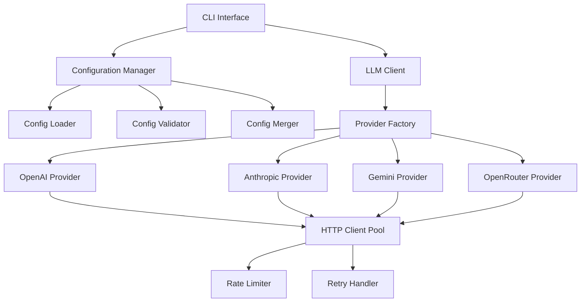
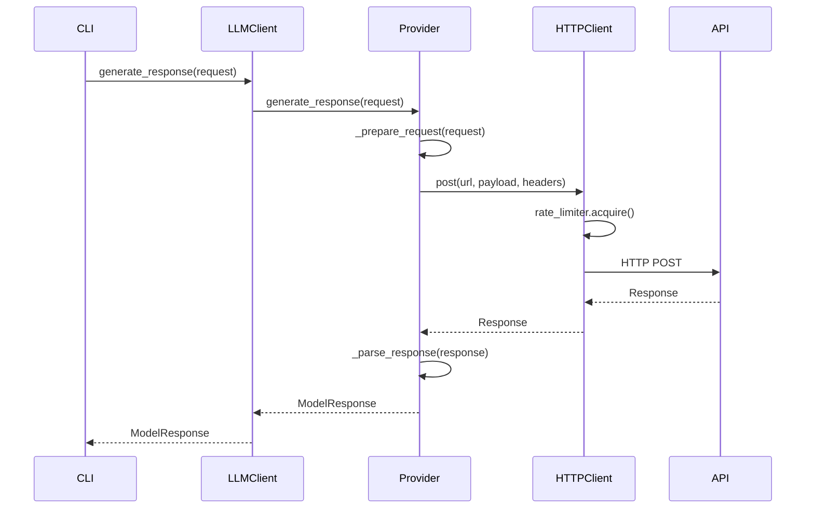

# Design Document

## Overview

The LLM Connector feature provides a unified interface for connecting to multiple Large Language Model providers through a configuration-driven approach. The design follows the existing project architecture with modular components, comprehensive error handling, and extensible provider support. The connector abstracts provider-specific implementations behind a common interface while supporting provider-specific parameters and authentication methods.

## Architecture

### High-Level Architecture



### Module Structure

The LLM connector follows the existing project structure under `rationale_benchmark/llm/`:

```
rationale_benchmark/llm/
├── __init__.py
├── client.py              # Main LLM client interface
├── config/
│   ├── __init__.py
│   ├── loader.py          # Configuration loading and merging
│   ├── validator.py       # Configuration validation
│   └── models.py          # Configuration data models
├── providers/
│   ├── __init__.py
│   ├── base.py            # Abstract provider interface
│   ├── openai.py          # OpenAI provider implementation
│   ├── anthropic.py       # Anthropic provider implementation
│   ├── gemini.py          # Google Gemini provider implementation
│   └── openrouter.py      # OpenRouter provider implementation
├── http/
│   ├── __init__.py
│   ├── client.py          # HTTP client with connection pooling
│   ├── rate_limiter.py    # Rate limiting implementation
│   └── retry.py           # Retry logic with exponential backoff
└── exceptions.py          # Custom exception classes
```

## Components and Interfaces

### Configuration Management

#### Configuration Data Models

```python
@dataclass
class ProviderConfig:
  """Configuration for a single LLM provider."""
  name: str
  api_key: str
  base_url: Optional[str] = None
  timeout: int = 30
  max_retries: int = 3
  models: List[str] = field(default_factory=list)
  default_params: Dict[str, Any] = field(default_factory=dict)
  provider_specific: Dict[str, Any] = field(default_factory=dict)

@dataclass
class LLMConfig:
  """Complete LLM configuration with all providers."""
  defaults: Dict[str, Any]
  providers: Dict[str, ProviderConfig]
  
  @classmethod
  def from_files(cls, config_dir: Path, config_name: str = "default-llms") -> "LLMConfig":
    """Load and merge configuration from files."""
    pass

@dataclass
class ModelRequest:
  """Request parameters for LLM generation."""
  prompt: str
  model: str
  temperature: float = 0.7
  max_tokens: int = 1000
  system_prompt: Optional[str] = None
  stop_sequences: Optional[List[str]] = None
  provider_specific: Dict[str, Any] = field(default_factory=dict)

@dataclass
class ModelResponse:
  """Standardized response from LLM providers."""
  text: str
  model: str
  provider: str
  timestamp: datetime
  latency_ms: int
  token_count: Optional[int] = None
  finish_reason: Optional[str] = None
  cost_estimate: Optional[float] = None
  metadata: Dict[str, Any] = field(default_factory=dict)
```

#### Configuration Loader

```python
class ConfigLoader:
  """Handles loading and merging of LLM configuration files."""
  
  def __init__(self, config_dir: Path):
    self.config_dir = config_dir
  
  def load_config(self, config_name: str) -> LLMConfig:
    """Load configuration with default merging."""
    default_config = self._load_default_config()
    if config_name != "default-llms":
      custom_config = self._load_custom_config(config_name)
      return self._merge_configs(default_config, custom_config)
    return default_config
  
  def list_available_configs(self) -> List[str]:
    """List all available configuration files."""
    pass
  
  def _resolve_environment_variables(self, config_dict: Dict) -> Dict:
    """Resolve ${VAR} patterns in configuration."""
    pass
```

#### Configuration Validator

```python
class ConfigValidator:
  """Validates LLM configuration structure and values."""
  
  def validate_config(self, config: LLMConfig) -> List[str]:
    """Validate complete configuration, return list of errors."""
    errors = []
    errors.extend(self._validate_defaults(config.defaults))
    for name, provider in config.providers.items():
      errors.extend(self._validate_provider(name, provider))
    return errors
  
  def validate_environment_variables(self, config: LLMConfig) -> List[str]:
    """Validate required environment variables are present."""
    pass
  
  def _validate_provider(self, name: str, provider: ProviderConfig) -> List[str]:
    """Validate individual provider configuration."""
    pass
```

### Provider Interface

#### Abstract Provider Base

```python
from abc import ABC, abstractmethod

class LLMProvider(ABC):
  """Abstract base class for all LLM providers."""
  
  def __init__(self, config: ProviderConfig, http_client: HTTPClient):
    self.config = config
    self.http_client = http_client
  
  @abstractmethod
  async def generate_response(self, request: ModelRequest) -> ModelResponse:
    """Generate response from the LLM."""
    pass
  
  @abstractmethod
  async def list_models(self) -> List[str]:
    """List available models for this provider."""
    pass
  
  @abstractmethod
  def validate_config(self) -> List[str]:
    """Validate provider-specific configuration."""
    pass
  
  @abstractmethod
  def _prepare_request(self, request: ModelRequest) -> Dict[str, Any]:
    """Convert ModelRequest to provider-specific format."""
    pass
  
  @abstractmethod
  def _parse_response(self, response: Dict[str, Any], request: ModelRequest) -> ModelResponse:
    """Convert provider response to ModelResponse."""
    pass
```

#### Provider Implementations

Each provider implements the abstract interface with provider-specific logic:

```python
class OpenAIProvider(LLMProvider):
  """OpenAI API provider implementation."""
  
  def __init__(self, config: ProviderConfig, http_client: HTTPClient):
    super().__init__(config, http_client)
    self.base_url = config.base_url or "https://api.openai.com/v1"
  
  async def generate_response(self, request: ModelRequest) -> ModelResponse:
    """Generate response using OpenAI API."""
    headers = {
      "Authorization": f"Bearer {self.config.api_key}",
      "Content-Type": "application/json"
    }
    
    payload = self._prepare_request(request)
    start_time = time.time()
    
    response = await self.http_client.post(
      f"{self.base_url}/chat/completions",
      json=payload,
      headers=headers
    )
    
    latency_ms = int((time.time() - start_time) * 1000)
    return self._parse_response(response.json(), request, latency_ms)
```

### HTTP Client and Connection Management

#### HTTP Client with Connection Pooling

```python
class HTTPClient:
  """HTTP client with connection pooling and rate limiting."""
  
  def __init__(self, max_connections: int = 100, timeout: int = 30):
    self.session = aiohttp.ClientSession(
      connector=aiohttp.TCPConnector(limit=max_connections),
      timeout=aiohttp.ClientTimeout(total=timeout)
    )
    self.rate_limiter = RateLimiter()
    self.retry_handler = RetryHandler()
  
  async def post(self, url: str, **kwargs) -> aiohttp.ClientResponse:
    """Make POST request with rate limiting and retries."""
    async with self.rate_limiter.acquire():
      return await self.retry_handler.execute(
        self.session.post, url, **kwargs
      )
```

#### Rate Limiting

```python
class RateLimiter:
  """Token bucket rate limiter for API requests."""
  
  def __init__(self, requests_per_minute: int = 60):
    self.requests_per_minute = requests_per_minute
    self.tokens = requests_per_minute
    self.last_update = time.time()
    self.lock = asyncio.Lock()
  
  async def acquire(self):
    """Acquire a token for making a request."""
    async with self.lock:
      now = time.time()
      elapsed = now - self.last_update
      self.tokens = min(
        self.requests_per_minute,
        self.tokens + elapsed * (self.requests_per_minute / 60)
      )
      self.last_update = now
      
      if self.tokens < 1:
        wait_time = (1 - self.tokens) * (60 / self.requests_per_minute)
        await asyncio.sleep(wait_time)
        self.tokens = 0
      else:
        self.tokens -= 1
```

### Main LLM Client

```python
class LLMClient:
  """Main client interface for LLM operations."""
  
  def __init__(self, config_dir: Path, config_name: str = "default-llms"):
    self.config = LLMConfig.from_files(config_dir, config_name)
    self.http_client = HTTPClient()
    self.providers = self._initialize_providers()
  
  async def generate_response(self, request: ModelRequest) -> ModelResponse:
    """Generate response using appropriate provider."""
    provider = self._get_provider_for_model(request.model)
    return await provider.generate_response(request)
  
  async def list_all_models(self) -> Dict[str, List[str]]:
    """List models from all configured providers."""
    results = {}
    for name, provider in self.providers.items():
      try:
        results[name] = await provider.list_models()
      except Exception as e:
        logger.error(f"Failed to list models for {name}: {e}")
        results[name] = []
    return results
  
  def validate_configuration(self) -> List[str]:
    """Validate complete configuration setup."""
    validator = ConfigValidator()
    errors = validator.validate_config(self.config)
    errors.extend(validator.validate_environment_variables(self.config))
    return errors
```

## Data Models

### Configuration Schema

The configuration follows a hierarchical structure supporting defaults and provider-specific overrides:

```yaml
# config/llms/default-llms.yaml
defaults:
  timeout: 30
  max_retries: 3
  temperature: 0.7
  max_tokens: 1000

providers:
  openai:
    api_key: "${OPENAI_API_KEY}"
    base_url: "https://api.openai.com/v1"
    models:
      - "gpt-4"
      - "gpt-3.5-turbo"
    default_params:
      temperature: 0.7
      max_tokens: 1000
  
  anthropic:
    api_key: "${ANTHROPIC_API_KEY}"
    base_url: "https://api.anthropic.com"
    models:
      - "claude-3-opus-20240229"
      - "claude-3-sonnet-20240229"
    default_params:
      temperature: 0.7
      max_tokens: 1000
```

### Request/Response Flow



## Error Handling

### Exception Hierarchy

```python
class LLMConnectorError(Exception):
  """Base exception for LLM connector errors."""
  pass

class ConfigurationError(LLMConnectorError):
  """Configuration-related errors."""
  pass

class AuthenticationError(LLMConnectorError):
  """Authentication and API key errors."""
  pass

class RateLimitError(LLMConnectorError):
  """Rate limiting errors."""
  pass

class ProviderError(LLMConnectorError):
  """Provider-specific errors."""
  def __init__(self, provider: str, message: str, original_error: Exception = None):
    self.provider = provider
    self.original_error = original_error
    super().__init__(f"{provider}: {message}")

class ModelNotFoundError(ProviderError):
  """Model not available error."""
  pass
```

### Error Handling Strategy

1. **Configuration Errors**: Fail fast during initialization with clear error messages
2. **Authentication Errors**: Provide specific guidance for each provider's authentication method
3. **Rate Limit Errors**: Implement exponential backoff with configurable retry limits
4. **Network Errors**: Retry with circuit breaker pattern for provider availability
5. **Model Errors**: Graceful degradation with alternative model suggestions

## Testing Strategy

### Unit Tests

```python
class TestConfigLoader:
  """Test configuration loading and merging."""
  
  def test_load_default_config(self):
    """Test loading default configuration."""
    pass
  
  def test_merge_custom_config(self):
    """Test merging custom configuration with defaults."""
    pass
  
  def test_environment_variable_resolution(self):
    """Test ${VAR} pattern resolution."""
    pass

class TestProviders:
  """Test provider implementations."""
  
  @pytest.mark.asyncio
  async def test_openai_provider_generate_response(self):
    """Test OpenAI provider response generation."""
    pass
  
  @pytest.mark.asyncio
  async def test_provider_error_handling(self):
    """Test provider error handling."""
    pass
```

### Integration Tests

```python
class TestLLMClientIntegration:
  """Integration tests for complete LLM client."""
  
  @pytest.mark.asyncio
  async def test_end_to_end_generation(self):
    """Test complete request/response flow."""
    pass
  
  def test_configuration_validation(self):
    """Test configuration validation with real config files."""
    pass
```

### Mock Strategy

- Mock HTTP responses for unit tests
- Use real configuration files in integration tests
- Mock environment variables for testing different scenarios
- Create provider-specific mock responses matching actual API formats

## Security Considerations

### API Key Management

1. **Environment Variables**: All API keys stored in environment variables
2. **No Logging**: API keys never logged or exposed in error messages
3. **Validation**: API key format validation without exposing values
4. **Rotation**: Support for API key rotation without application restart

### Request Security

1. **Input Sanitization**: Validate all request parameters
2. **Rate Limiting**: Prevent abuse through rate limiting
3. **Timeout Handling**: Prevent hanging requests
4. **Error Sanitization**: Remove sensitive data from error responses

## Performance Considerations

### Connection Management

- HTTP connection pooling to reduce connection overhead
- Configurable connection limits per provider
- Connection health monitoring and automatic reconnection

### Concurrent Requests

- Semaphore-based concurrency limiting
- Provider-specific rate limiting
- Async/await pattern for non-blocking operations

### Memory Management

- Streaming responses for large outputs
- Request/response size limits
- Proper resource cleanup in error scenarios

### Caching Strategy

- Configuration caching to avoid repeated file reads
- Model list caching with TTL
- Response caching for identical requests (optional feature)